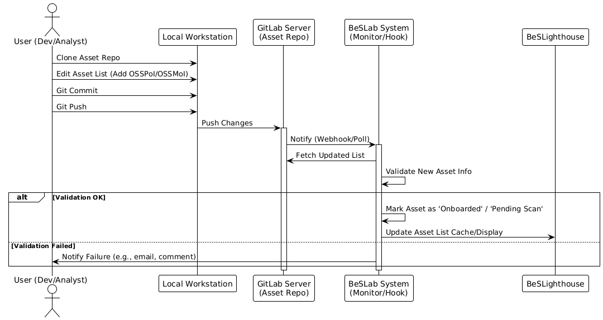
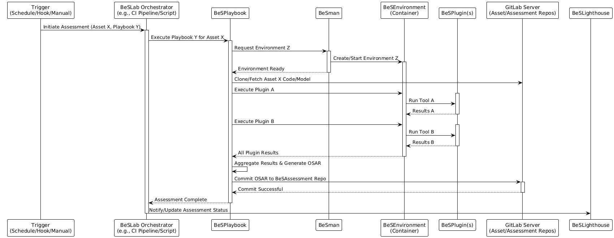
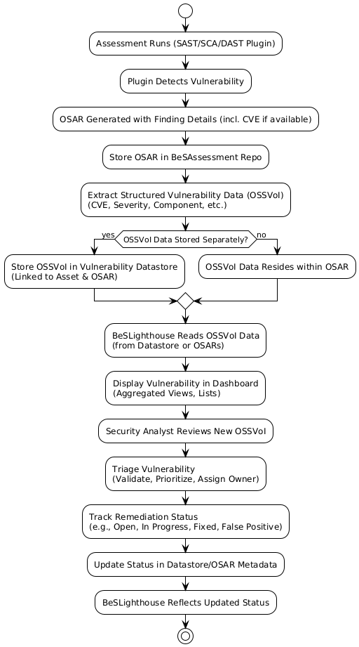
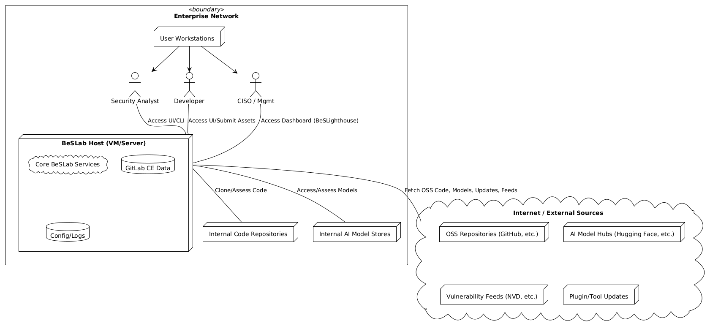
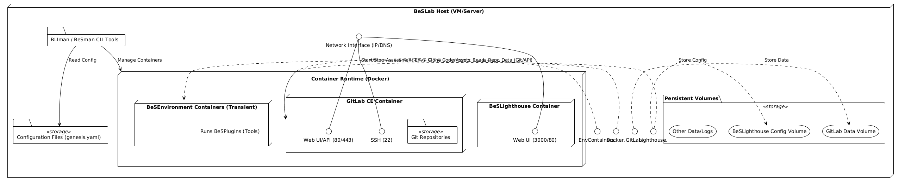

# **Setup Guide: Establishing and Operating an AI Security Lab with the Be-Secure BeSLab Blueprint**

**Table of Contents**
-[Part 1: Understanding BeSLab](#part-1)
 -[1.1Introduction: Your AI Security Lab ](#1)
  -[1.1.1 What is BeSLab and Why Use It](#1.1.1)
  -[1.2.1 The Be-Secure Philosophy: Beyond a Single Tool](#1.1.2)
  -[1.3.1 Value for the CISO and Security Team](#1.1.3)
  -[1.4.1 Scope of this guide](#1.1.4)
 -[1.2.How BeSLab works Architecture and Concepts ](#1.2)
  -[1.2.11-introduction-your-ai-security-lab)](#1.2.1)
  -[1.2.2 The gitops](#1.2.2)
  -[1.2.3 Key terms you need to know](#1.2.3)
-[Part 2: setting-up-and-configuring-your-lab](#part-2)
  -[2.1.1 Setting up your private BeSLab in Lite Mode](#2.1.1)
  -[2.1.2 before-you-begin-prerequisites-checklist](#2.1.2)
  -[2.1.3 step-by-step-installation-using-bliman](#2.1.3)
  -[2.1.4 initial-verification-checking-your-setup](#2.1.4)
 -[2.2 configuring-your-beslab-instance](#2.2)
 -[2.2.1 Essential GitLab Configuration](#2.2.1)

[2.2.2](#42-setting-up-be-secure-repositories-in-gitlab)

[2.2.3](#43-connecting-beslighthouse-to-your-data)

[Part 3: Populating and Operating Your Lab]

[5. Populating Your Lab: Onboarding Guide]

[Part 4: Defaults and Governance]

[]7.1 Why Defaults Matter

(#74-recap-default-security-tools-besplugins)

(#8-reporting-and-governance-for-your-lab)

(#81-standard-assessment-reports-osar-structure)

(#82-defining-roles-and-responsibilities-raci-matrix)

8.3 Key Governance Policies to Establish

Part 5: Visual Aids and Conclusion

(#9-visualizing-the-setup)

9.1 High-Level Enterprise View

9.2 Detailed Component Layout
(#10-conclusion-and-next-steps)

(#101-summary-of-benefits)

(#102-immediate-actions-after-setup)
(#103-continuous-improvement-roadmap)

-[11. Works Cited](#11)

## <a id="part-1-understanding-beslab">**Part 1: Understanding BeSLab**</a>

### <a id="1-introduction-your-ai-security-lab)">**1\. Introduction: Your AI Security Lab**</a>

#### <a id="1.1">**1.1 What is BeSLab and Why Use It?**</a>  
  In today's digital world, organizations heavily rely on Open Source Software (OSS) and Artificial Intelligence (AI) / Machine Learning (ML) models. While these components accelerate innovation, they also introduce security risks from potential vulnerabilities within them and the unique ways AI models can be attacked. Effectively managing these risks demands a structured and proactive strategy.  
  Establishing a dedicated AI Security Lab, based on the BeSLab blueprint, provides an organization's security team (specifically the CISO's office) with the necessary *internal* capability. It allows the organization to systematically check, track, and reduce the security risks tied to the OSS and AI components it uses or considers using . This focus on building internal capacity is central; BeSLab facilitates the development of in-house expertise and provides direct control over the security assurance process for these critical third-party assets, moving beyond reliance on external assessments or inconsistent manual reviews.  
#### <a id="1.2">**1.2 The Be-Secure Philosophy: Beyond a Single Tool**</a>  
  The Be-Secure initiative aims to help organizations and the wider community strengthen open source artifacts—software, ML models, and datasets—against vulnerabilities . The BeSLab blueprint stems from this goal, offering a design for an open-source security lab.  
  It is crucial to understand that BeSLab is not a single software product that can be installed with one click. Instead, it is a *blueprint* or an *architectural pattern* . Think of it as a template defining how various tools and processes work together to create a comprehensive security assessment environment . This approach provides significant flexibility, allowing organizations to tailor the lab's capabilities. However, it also means that implementation involves assembling and integrating these components according to the blueprint's design, rather than installing a monolithic application. The core objective is to give application security and security operations teams full control and transparency over how these critical components are assessed .  
#### **1.3 Value for the CISO and Security Teams**  
  Implementing a BeSLab instance based on this blueprint delivers clear advantages for the CISO's organization and security teams :  
  * **Standardized Assurance:** Creates consistent and repeatable processes for security assessments of both OSS projects and AI models.  
  * **Centralized Visibility:** Offers a unified view through the BeSLighthouse dashboard, tracking Projects of Interest (OSSPoI), Models of Interest (OSSMoI), and related Vulnerabilities of Interest (OSSVoI) .  
  * **Reduced Risk Exposure:** Enables proactive identification and facilitates the fixing of vulnerabilities in essential software and models before attackers can exploit them.  
  * **Cost Efficiency:** Can lower the overall cost of risk assessment compared to frequent external security engagements or time-consuming manual reviews, especially as the number of tracked assets increases .  
  * **Internal Attestation:** Allows the organization to generate internal trust marks, such as a "Trusted and Verified Open Source Software" (TAVOSS) designation, for components that pass the lab's defined security checks . This TAVOSS status serves as a tangible outcome, providing a standardized way to communicate assurance levels internally and build confidence in the security posture of approved components .  
#### **1.4 Scope of This Guide**  
  This document serves as a comprehensive user guide focused specifically on setting up, configuring, and operating a *private* AI Security Lab using the BeSLab blueprint within an enterprise setting. It details the *'Lite Mode'* deployment, which consolidates essential components onto a single host machine, and covers integration with GitLab Community Edition (CE) as the code collaboration platform . The guide walks through the entire lifecycle: understanding the architecture, meeting prerequisites, installation steps, onboarding users, projects, models, and tools, defining operational workflows for security assessments, generating reports (OSARs), establishing governance (RACI), and configuring default components.

## <a id="2"> **2\. How BeSLab Works: Architecture and Concepts**</a>

### <a id="2.1"> **2.1 The Blueprint Explained: Core Components**</a>  
  The BeSLab architecture, being a blueprint, defines how various components interact to form a working security lab . It integrates existing open-source tools with specific Be-Secure utilities and data structures to build a cohesive system for security assessment . A typical private BeSLab instance deployed in Lite Mode, as covered in this guide, includes these core parts :  
  * **Git-based Source Code Management (SCM) Platform (e.g., GitLab CE):** This is the central nervous system of the BeSLab instance. It hosts the critical datastore repositories containing configurations, definitions of assets (OSSPoI, OSSMoI), assessment playbooks, environment definitions, and the assessment results (OSARs) . Using GitLab CE provides a powerful, self-hosted platform supporting version control, collaboration, and potential CI/CD integration for automating assessment workflows.  
  * **Datastore Repositories:** These are specific Git repositories within the SCM platform designated for storing different types of lab data. Common examples include :  
    * BeSEnvironment: Stores definitions and scripts for creating assessment environments.  
    * BeSPlaybook: Contains the scripts and configurations defining assessment workflows (playbooks).  
    * BeSAssessment: Archives the generated Open Source Assessment Reports (OSARs) and related metadata.  
    * Asset Stores (e.g., besecure-assets-store): Repositories holding lists and details of tracked OSSPoI, OSSMoI, etc. The precise naming and structure are important for tools like BeSLighthouse to locate data correctly .  
  * **BeSLighthouse:** A web-based dashboard application providing the main user interface for visualizing the lab's data . It reads information directly from the designated Git datastore repositories and presents views of tracked assets, associated vulnerabilities, assessment statuses, and links to detailed reports . Its direct reliance on the Git backend reinforces the GitOps model described below.  
  * **BLIman (BeSLab Lifecycle Management):** A command-line interface (CLI) tool specifically created for deploying, configuring, and managing the lifecycle of a BeSLab instance . It uses a configuration file (genesis.yaml) to define the lab's setup and provides commands like bli load, bli initmode, and bli launchlab to orchestrate the installation .  
  * **BeSman (BeS Environment Manager):** Another CLI utility, working alongside BLIman, focused on creating and managing the BeSEnvironments needed for assessments . It is typically installed during the BLIman setup and used by playbooks to provision the correct runtime environments for security tools . The reliance on distinct CLI tools like BLIman and BeSman for core management tasks means that administrators need proficiency with command-line operations. Automation efforts, operational procedures, and troubleshooting will heavily involve executing and scripting these commands, differing from purely GUI-managed systems.  
  * **BeSEnvironment:** Represents a specific computing setup (often a container image or defined by setup scripts) containing the necessary tools, libraries, and dependencies to run a particular set of security assessments . These ensure assessments are consistent and repeatable. They are defined in the BeSEnvironment repository and managed by BeSman .  
  * **BeSPlaybook:** An automated script or workflow designed to orchestrate specific security assessment tasks . A playbook typically specifies which BeSEnvironment to use and which BeSPlugins (security tools) to run in sequence, along with configuration and data handling steps. Playbooks codify the assessment process for different asset types or security checks (e.g., SAST scan for Python code, AI model safety check).  
  * **BeSPlugin:** Represents an integration wrapper around a specific security tool (e.g., a SAST scanner like Semgrep, an SCA tool like Trivy, a secrets detector like Gitleaks, or an AI model analyzer) . These plugins are the "workhorses" that perform the actual security scans. They are called by BeSPlaybooks within the appropriate BeSEnvironment. The lab's assessment capabilities are directly determined by the range and quality of integrated BeSPlugins. The framework is extensible, allowing new tools to be added as plugins over time .  
### <a id="2.2"> **2.2 The GitOps Foundation**<a>  
  A fundamental aspect of the BeSLab architecture is its reliance on a GitOps workflow for managing the lab itself . This means that nearly all configurations, operational state definitions, asset lists, assessment playbooks, environment definitions, and even assessment results (OSARs) reside within Git repositories hosted on the SCM platform (like GitLab CE) .  
  Changes to the lab's setup—adding a new project to track, modifying an assessment playbook, updating an environment, or configuring a tool—are managed through standard Git operations: making changes, committing them with descriptive messages, and pushing them to the central repository. This approach offers significant advantages for managing the security lab infrastructure:  
  * **Auditability:** Every change is recorded in the Git history, providing a clear audit trail of who changed what and when.  
  * **Version History:** Previous configurations and states can be easily reviewed or restored if needed.  
  * **Reproducibility:** The entire lab configuration is defined in code, making it easier to replicate the setup or recover from failures.  
  * **Collaboration:** Multiple team members can collaborate on managing the lab's configuration using familiar Git workflows.  
  * **Infrastructure-as-Code:** It treats the lab's configuration and operational definitions as code, promoting discipline, automation potential, and reliability in its management. BeSLighthouse reading directly from these repositories further reinforces this model, ensuring the dashboard always reflects the state defined in Git .  
* **2.3 Key Terms You Need to Know**  
  Understanding this terminology is essential for working with BeSLab :  
  * **OSSPoI (Open Source Projects of Interest):** Specific open-source software projects your organization uses or depends on, which are onboarded into the lab for security assessment and monitoring.  
  * **OSSMoI (Open Source Models of Interest):** Specific open-source AI/ML models used or considered by your organization, onboarded for security and safety assessments.  
  * **OSSVoI (Open Source Vulnerabilities of Interest):** The specific vulnerabilities (often identified by CVEs or similar IDs) discovered within the tracked OSSPoI and OSSMoI. The lab focuses on tracking and managing these relevant vulnerabilities .  
  * **OSAR (Open Source Assessment Report):** The standardized report generated after a BeSPlaybook completes an assessment run . It details the scope, methods, findings (including OSSVoI), risk posture, and potentially remediation advice. OSARs should ideally follow the BeS Schema for consistency .  
  * **TAVOSS (Trusted and Verified Open Source Software):** An internal designation indicating that an OSS project or AI model has passed a defined assessment process within your BeSLab instance and meets your organization's security criteria . Achieving TAVOSS status signifies a higher level of confidence based on the internal assessment . The lab facilitates identifying or distributing these TAVOSS-approved versions internally .  
  * **OSAP (Open Source Assurance Provider):** Each BeSLab instance acts as an OSAP . In the context of this guide (a private lab), your organization functions as its own internal OSAP, providing assurance for the assets it monitors.  
  * **BeS Schema / Exchange Schema:** A standardized data format defined by Be-Secure to enable consistent exchange of information about assets, vulnerabilities, and assessments between BeSLab components and potentially other systems or labs . Adhering to this schema, even in a private deployment, promotes interoperability, allows consistent data processing and visualization (e.g., by BeSLighthouse), simplifies tool development, and ensures reports (OSARs) have a uniform structure, making the lab's data more valuable and future-proof .

**Part 2: Setting Up and Configuring Your Lab**

**3\. Setting Up Your Private BeSLab (Lite Mode)**

* **3.1 Before You Begin: Prerequisites Checklist**  
  Ensuring the target environment meets all requirements before starting installation is crucial for avoiding common setup problems. A dedicated host machine (a Virtual Machine is recommended for easier management and snapshots) is needed .  
  The following table summarizes the key prerequisites for deploying a private BeSLab Lite Mode instance. Meeting the recommended specifications is advisable for enterprise use to ensure adequate performance, especially for GitLab and concurrent assessments. Sufficient disk space is particularly important for storing Git repository data, container images, and potentially large assessment artifacts or logs.

| Category | Requirement | Details / Recommendations | Reference |
| :---- | :---- | :---- | :---- |
| **Hardware** | CPU | Min: 4 vCPU, Recommended: 8+ vCPU |  |
|  | RAM | Min: 8 GB, Recommended: 16+ GB |  |
|  | Disk Space | Min: 16 GB, Recommended: 100+ GB (SSD) |  |
| **Software** | Operating System | Ubuntu LTS Recommended |  |
|  | Utilities | curl, unzip, bash, git, sudo access |  |
|  | Container Runtime | Docker Engine or compatible | Implied |
|  | NodeJS | v16.0+ |  |
|  | Python | Python 3, pip (Optional, depending on tools/methods) |  |
| **Network** | Host Addressing | Static IP or resolvable DNS hostname | Required |
|  | Internet Access | Outbound access for downloads/updates | Required |
|  | Firewall Ports | SSH (22), HTTP/S (80/443 for GitLab), BeSLighthouse Port (e.g., 3000 or 80), potentially others | Required |
|  | Internal Access | User access to GitLab/BeSLighthouse UIs | Required |
| **Accounts** | Host OS User | User with sudo privileges |  |
|  | GitLab Admin | Initial credentials set via genesis.yaml, change immediately |  |

**Table 1: Prerequisites Summary**

This guide assumes GitLab CE will be installed by the BLIman \`launchlab\` process . Using an existing GitLab instance requires significant manual configuration beyond this standard guide.

* **3.2 Step-by-Step Installation using BLIman**  
  Follow these steps to install a private BeSLab instance in 'Lite Mode' using the BLIman CLI tool . Lite Mode installs core components like GitLab CE and BeSLighthouse onto the single prepared host . The installation is driven by the genesis.yaml configuration file.  
  1. **Prepare Host:** Log in to the designated host machine (which meets all prerequisites) using an account with sudo privileges .  
  2. **Install BLIman:** Install the BeSLab Lifecycle Management tool. Always refer to the official Be-Secure/BLIman repository for the most current installation instructions . Example commands (verify URLs):  
     Bash  
     \# Example installation commands (Verify against official BLIman README)  
     \# Download the installer script (URL might change)  
     curl \-sSL \<URL\_TO\_BLIman\_Installer\_Script\> \-o install-bliman.sh

     \# Run the installer script  
     sudo bash install-bliman.sh

     \# Clean up installer script  
     rm install-bliman.sh

     \# Verify installation by checking the help command  
     bli help  
     Successful execution of bli help confirms installation.  
  3. **Configure genesis.yaml:** Create the genesis.yaml file in your working directory. This file defines all parameters for the BeSLab instance . Customize the values below (especially URLs, IPs, ports, and the initial GitLab password) for your environment.  
     YAML  
     \# Sample genesis.yaml for Private Lite Mode  
     \# \--- Global Configuration \---  
     beslab\_mode: "lite" \# Specifies Lite Mode deployment  
     deployment\_type: "private" \# Specifies a private instance

     \# \--- GitLab Configuration \---  
     gitlab:  
       host\_url: "http://\<YOUR\_GITLAB\_IP\_OR\_DNS\>" \# \*\*REQUIRED\*\*: URL users will use  
       initial\_root\_password: "\<YOUR\_SECURE\_INITIAL\_PASSWORD\>" \# \*\*REQUIRED\*\*: Set a strong temporary password  
       \# Optional: Specify ports if not default 80/443/22  
       \# http\_port: 80  
       \# https\_port: 443  
       \# ssh\_port: 22  
       \# Optional: Specify data volume path  
       \# data\_volume: "/srv/gitlab/data"

     \# \--- BeSLighthouse Configuration \---  
     beslighthouse:  
       host\_ip: "0.0.0.0" \# Listen on all interfaces within the container  
       host\_port: "3000" \# \*\*REQUIRED\*\*: Port BeSLighthouse will listen on (e.g., 3000\)  
       \# Optional: Specify data volume path  
       \# config\_volume: "/srv/beslighthouse/config"

     \# \--- Other Optional Configurations (Add as needed based on BLIman documentation) \---  
     \# Example: Default user settings, registry settings, etc.  
     **Critical Security Note:** Choose a strong, unique initial\_root\_password for GitLab. This password **must** be changed immediately after the first login. Store the genesis.yaml file securely.  
  4. **Load Configuration:** Use BLIman to parse and load the configuration :  
     Bash  
     \# Ensure you are in the directory containing genesis.yaml or provide the full path  
     bli load genesis.yaml  
     Address any validation errors reported by BLIman.  
  5. **Initialize Mode:** Prepare BLIman for the 'lite' deployment mode :  
     Bash  
     bli initmode lite

  6. **Initialize BeSman:** Initialize the BeS Environment Manager, usually installed by bli initmode :  
     Bash  
     source $HOME/.besman/bin/besman-init.sh  
     Verify initialization by checking its help command :  
     Bash  
     bes help

  7. **Launch the Lab:** Start the main deployment process :  
     Bash  
     bli launchlab  
     This command downloads Docker images, configures and starts containers (GitLab, BeSLighthouse), sets up networking/volumes, and potentially seeds initial GitLab structures . This step can take significant time. Monitor the console output for errors.  
* **3.3 Initial Verification: Checking Your Setup**  
  Once bli launchlab finishes successfully, verify the installation :  
  1. **Access GitLab UI:** Open a web browser and go to the gitlab.host\_url defined in genesis.yaml.  
  2. **Login to GitLab:** Use username root and the initial\_root\_password from genesis.yaml.  
  3. **CRITICAL: Change GitLab Password:** GitLab will force a password change on first login. Set a new, strong, unique password and store it securely. This is vital for security.  
  4. **Access BeSLighthouse UI:** Open another browser tab and navigate to http://\<BeSLab\_Host\_IP\_OR\_DNS\>:\<beslighthouse.host\_port\> (e.g., http://192.168.1.100:3000).  
  5. **Verify BeSLighthouse Load:** The dashboard should load. Expect lists like "Projects Of Interest" to be empty initially .  
  6. **(Optional) Check Container Status:** On the BeSLab host, run docker ps to confirm the GitLab and BeSLighthouse containers are running.

Successful completion of these checks indicates the core BeSLab infrastructure is operational.

**4\. Configuring Your BeSLab Instance**

* **4.1 Essential GitLab Configuration**  
  After the initial setup and password change, configure these GitLab settings relevant for BeSLab :  
  * **User Sign-up Restrictions:** Navigate to Admin Area \-\> Settings \-\> General \-\> Sign-up restrictions. It is strongly recommended to *disable* new sign-ups (uncheck "Sign-up enabled") to prevent unauthorized access. If self-registration is needed later, enable admin approval.  
  * **Group/Project Creation Permissions:** Go to Admin Area \-\> Settings \-\> General \-\> Account and limit settings. Review who can create top-level groups and projects. Restricting this to Administrators initially is advisable for better control.  
  * **(Future Use) Runner Configuration:** If planning to automate assessment workflows using GitLab CI/CD pipelines later, GitLab Runners will need to be configured. This is an advanced step involving setting up agents that can execute jobs, potentially interacting with Docker or the BeSLab host.  
* **4.2 Setting Up Be-Secure Repositories in GitLab**  
  BeSLab relies on a specific structure of Git repositories within GitLab to store its data and configurations . While bli launchlab might perform some setup, manually creating or verifying these core repositories is often necessary. The precise naming and structure are important, as tools like BeSLighthouse often expect specific repository names and locations to function correctly . Deviating from expected conventions might prevent the dashboard or other tools from finding and processing data.  
  1. **Login to GitLab:** Log in as the root user or another administrator.  
  2. **Create a Top-Level Group:** Create a new group (e.g., besecure-lab) to logically organize all BeSLab-related repositories.  
  3. **Create Core Repositories:** Within the besecure-lab group, create the following projects (Git repositories). Initialize each with at least a README file:  
     * BeSEnvironment: Stores assessment environment definitions (e.g., Dockerfiles).  
     * BeSPlaybook: Stores assessment playbook scripts.  
     * BeSAssessment: Stores assessment output reports (OSARs) and metadata.  
     * besecure-assets-store (or the name expected by BeSLighthouse's configuration): Stores lists/definitions of OSSPoI, OSSMoI, etc. .  
     * Potentially others depending on specific configurations or extensions.  
* **4.3 Connecting BeSLighthouse to Your Data**  
  BeSLighthouse needs to be configured to find the data repositories within your private GitLab instance . This step activates the dashboard by linking the visualization front-end to the Git-based data back-end.  
  1. **Locate datastore.ts:** Access the BeSLab host machine (e.g., via SSH). Find the BeSLighthouse installation directory. The exact path depends on the deployment, potentially within a Docker volume mount (check docker inspect \<container\_id\> for volume details) or a location like /opt/BeSLighthouse or /usr/local/share/beslighthouse. Inside this directory, locate the configuration file, typically src/config/datastore.ts .  
  2. **Edit datastore.ts:** Open the file using a text editor (like nano or vim). Find the variables defining the URLs for the datastore repositories. Update these URLs to point to the repositories created in **your private GitLab instance** within the besecure-lab group .  
     * Example modification:  
       TypeScript  
       // Before modification (example pointing to public GitHub)  
       // export const PoI\_Repo\_URL \= "https://github.com/Be-Secure/besecure-assets-store.git";  
       // export const Assessment\_Repo\_URL \= "https://github.com/Be-Secure/besecure-assessment-datastore.git";

       // After modification (pointing to internal GitLab)  
       export const PoI\_Repo\_URL \= "http://\<YOUR\_GITLAB\_IP\_OR\_DNS\>/besecure-lab/besecure-assets-store.git";  
       export const Assessment\_Repo\_URL \= "http://\<YOUR\_GITLAB\_IP\_OR\_DNS\>/besecure-lab/BeSAssessment.git";  
       // Update other relevant repository URLs (MoI, ML assessments, etc.) similarly

  3. **Restart BeSLighthouse:** Apply the changes by restarting the BeSLighthouse service or container. If using Docker:  
     Bash  
     \# Find the BeSLighthouse container ID or name  
     sudo docker ps

     \# Restart the container  
     sudo docker restart \<container\_id\_or\_name\>

  4. **Verify Connection:** Refresh the BeSLighthouse UI in your browser. Although the lists will still be empty until data is added, check the browser's developer tools (Network tab) or the container logs (sudo docker logs \<container\_id\_or\_name\>) for any errors related to accessing the configured GitLab repository URLs. Successful connection means BeSLighthouse can now read data once it's populated in the repositories.

**Part 3: Populating and Operating Your Lab**

**5\. Populating Your Lab: Onboarding Guide**

* **5.1 Managing User Access and Roles**  
  Properly managing user access is crucial for security and operational efficiency. Define roles within the BeSLab context and map them to GitLab's permission model to control who can perform specific actions .  
  * **Typical Roles:**  
    * **Lab Administrator:** Installs, configures, maintains, and upgrades BeSLab; manages users; integrates core tools. Requires high-level privileges.  
    * **Security Analyst:** Onboards assets (OSSPoI/OSSMoI), defines and triggers assessments, reviews reports (OSARs), triages vulnerabilities (OSSVoI), customizes assessment workflows (playbooks). Needs broad operational access.  
    * **Developer / Asset Owner:** Submits their projects/models for assessment, views reports relevant to their assets, responsible for implementing fixes. Needs access primarily to specific results.  
    * **CISO / Management:** Oversees the overall risk posture via dashboards (BeSLighthouse) and summary reports. Typically requires read-only access.  
  * **GitLab Permission Mapping (Example):**  
    * Lab Administrator: Assign Owner role on the top-level besecure-lab group in GitLab.  
    * Security Analyst: Assign Maintainer role on the besecure-lab group.  
    * Developer / Asset Owner: Assign Developer or Reporter role on specific projects/repositories relevant to them.  
    * CISO / Management: Assign Guest or Reporter role on the besecure-lab group for viewing access.  
  * **Onboarding Process:**  
    1. The Lab Administrator logs into GitLab.  
    2. Navigates to Admin Area \-\> Overview \-\> Users.  
    3. Creates new user accounts as needed (assuming sign-up is restricted).  
    4. Navigates to the besecure-lab group \-\> Group information \-\> Members.  
    5. Invites users to the group, assigning the appropriate role based on the mapping above. Permissions can be further refined on individual sub-projects (repositories) if necessary.  
* **5.2 Adding Projects (OSSPoI) for Assessment**  
  Onboarding Open Source Projects of Interest (OSSPoI) means adding the software projects your organization relies on to the lab's tracking system so they can be assessed .  
  * **Definition:** OSSPoI are specific open-source software projects deemed important or critical enough by the organization to warrant regular security assessment.  
  * **Process:** The process leverages the GitOps workflow:  
    1. Identify the OSS project to onboard.  
    2. Locate the designated asset tracking repository in GitLab (e.g., besecure-lab/besecure-assets-store).  
    3. Clone this repository to your local machine.  
    4. Edit the relevant file within the repository (e.g., osspoi\_list.yaml or projects.json, depending on the convention established). Add an entry for the new project, including metadata such as Project Name, Source Code URL (e.g., Git repository URL), specific Version(s) of interest, and potentially a flag indicating if it's targeted for TAVOSS designation.  
    5. Commit the changes locally using a clear, descriptive commit message (e.g., "Add OSSPoI: Apache Commons Text v1.10").  
    6. Push the changes back to the central GitLab repository. BeSLighthouse should automatically pick up the changes on its next refresh cycle .  
  * **TAVOSS Designation:** Marking an OSSPoI for TAVOSS signifies an intent to subject it to a more rigorous assessment process defined by the organization, aiming to achieve the internal 'Trusted and Verified' status .  
  * **Example OSSPoI Candidates:** Prioritize projects based on their criticality to business operations, widespread usage within the organization, known history of vulnerabilities, or handling of sensitive data.

| OSSPoI Candidate | Rationale | Potential Assessment Focus |
| :---- | :---- | :---- |
| Apache Log4j 2 | Critical logging library; past vulnerabilities | SCA (Dependencies), SAST (Java) |
| Apache Struts2 | Web framework; history of RCE vulnerabilities | SCA, SAST (Java), DAST |
| Spring Boot / Framework | Widely used Java framework | SCA, SAST (Java), Secrets Scan |
| TensorFlow | Foundational ML framework | SCA (Python deps), SAST (Python) |
| PyTorch | Foundational ML framework | SCA (Python deps), SAST (Python) |
| Node.js Express | Common web framework for Node.js | SCA (npm), SAST (JavaScript/TS) |
| Internal Shared Library X | Critical internal component used by many apps | SAST, SCA, Secrets Scan |

  **Table 2: Example OSSPoI Candidates**

* **5.3 Adding AI Models (OSSMoI) for Assessment**  
  Similar to software projects, Open Source Models of Interest (OSSMoI) need to be onboarded for tracking and security/safety assessment .  
  * **Definition:** OSSMoI are specific open-source AI/ML models used or being considered for use by the organization.  
  * **Process:** This follows the same Git-based workflow used for OSSPoI. An analyst or administrator clones the asset tracking repository (or a dedicated model repository), edits the designated list file (e.g., ossmoi\_list.yaml), adds the new model with relevant metadata (Model Name, Source URL/Identifier like Hugging Face Hub ID, Version, Base Model if fine-tuned, License information), commits, and pushes the changes.  
  * **Example OSSMoI Candidates:** Focus on models relevant to the organization's AI strategy, particularly those used in production, handling sensitive data, or interacting with users.

| OSSMoI Candidate | Rationale | Potential Assessment Focus |
| :---- | :---- | :---- |
| BERT (e.g., base-uncased) | Popular foundational NLP model | Model Scanning (safety, e.g., unsafe operators), Provenance Checks, License Compliance |
| Stable Diffusion (e.g., v1.5) | Widely used image generation model | Model Scanning, License Compliance, Potential Bias Checks |
| Llama (e.g., Llama-2-7b-hf) | Common open Large Language Model (LLM) | Model Scanning (safety), License Compliance, Responsible AI checks |
| GPT-2 | Foundational LLM, often used for experiments | Model Scanning, Provenance Checks |
| Internally Fine-tuned Model Y | Model derived from OSSMoI, used in production | Model Scanning, Fine-tuning Data Privacy Review, Robustness Testing |

    **Table 3: Example OSSMoI Candidates**

* **5.4 Integrating Security Tools (BeSPlugins)**  
  The actual security assessment capabilities of the BeSLab depend entirely on the integrated security tools, made available via BeSPlugins . Integrating these tools is therefore a fundamental task.  
  * **Definition:** A BeSPlugin acts as the integration layer or wrapper that allows a BeSPlaybook to invoke a specific security tool (like a scanner or linter) within the BeSLab framework .  
  * **Integration Process:**  
    1. **Identify Tool:** Select the security tool needed (e.g., Semgrep for code pattern matching, Trivy for vulnerability scanning, Bandit for Python security linting, Gitleaks for secret detection, OWASP ZAP for dynamic scanning, or a specialized AI model scanner).  
    2. **Check Existing Plugins:** Look within the Be-Secure community repositories or internal repositories for pre-built BeSPlugins for the chosen tool. Reusing existing plugins saves significant effort.  
    3. **Develop/Configure Plugin:** If no suitable plugin exists, one needs to be developed or configured. This typically involves creating a script (e.g., shell script, Python script) that:  
       * Knows how to execute the security tool with appropriate arguments (taking input like target repository path or URL).  
       * Parses the tool's output (e.g., JSON, XML, plain text).  
       * Ideally, transforms the output into the standardized BeS Schema format for consistent reporting and processing .  
       * Defines any dependencies required by the tool or the wrapper script.  
       * Is packaged or made available for execution within a BeSEnvironment.  
    4. **Define BeSEnvironment:** Ensure a suitable BeSEnvironment exists (or create one) that contains the security tool itself and all its runtime dependencies (e.g., specific Python version, libraries, OS packages). This environment definition (e.g., a Dockerfile) should reside in the BeSEnvironment repository .  
    5. **Reference in BeSPlaybook:** Update an existing BeSPlaybook or create a new one in the BeSPlaybook repository to invoke the newly integrated BeSPlugin at the appropriate step in the assessment workflow .  
  * **Extensibility:** This plugin-based architecture is designed for extensibility, allowing the organization to add new security tools, techniques, or custom checks over time as threats evolve and new technologies are adopted .  
  * **Example Default BeSPlugins:** Start by integrating a core set of plugins covering common security assessment types. The effectiveness of the lab is directly linked to the quality and breadth of these integrated plugins. Maintaining them (e.g., updating tools, adapting parsers) requires ongoing effort but is essential for deriving value.

| BeSPlugin Example | Tool Integrated (Example) | Security Assessment Type | Purpose |
| :---- | :---- | :---- | :---- |
| Semgrep-Plugin | Semgrep | SAST | Static code analysis using customizable pattern matching. |
| Trivy-Plugin | Trivy | SCA, Container Scanning | Detects known vulnerabilities in OS packages & dependencies. |
| Bandit-Plugin | Bandit | SAST (Python) | Finds common security issues specifically in Python code. |
| Gitleaks-Plugin | Gitleaks | Secret Scanning | Detects hardcoded secrets (API keys, passwords) in Git history. |
| OWASP-ZAP-Plugin | OWASP ZAP | DAST | Dynamic analysis of web application vulnerabilities via crawling/attacking. |
| ModelScan-Plugin | ModelScan (or similar) | AI Model Security | Scans ML models for unsafe operators, serialization issues, etc. |

    **Table 4: Example Default BeSPlugins**

**6\. Operating Your BeSLab: Workflows in Action**

* **6.1 Submitting Assets for Assessment**  
  Define a clear process for how new projects (OSSPoI) and models (OSSMoI) are submitted for tracking and assessment :  
  * **Manual Git Update:** Authorized users (e.g., Security Analysts) directly clone the asset repository, edit the list file, commit, and push the changes. This is the simplest method and aligns directly with the GitOps model.  
  * **GitLab Merge Request (MR):** Developers or other stakeholders can submit changes to the asset list file via a GitLab Merge Request. This allows Security Analysts to review and approve the submission before it's merged into the main branch, providing an approval gate.  
  * **API Integration (Advanced):** For more sophisticated integration, scripts or internal tools could interact with the GitLab API to update the asset lists, potentially triggered by events in other systems (e.g., a new project created in an internal registry).

*Diagram Reference:* The Git-based submission process, whether manual or via MR, is conceptually illustrated in **Diagram 3: Project/Model Onboarding Flow**  

* **6.2 Running Security Assessments**  
  Assessments are executed using the defined BeSPlaybooks, which orchestrate the use of BeSEnvironments and BeSPlugins . The separation of these components provides modularity—allowing environments to be reused across playbooks, or playbooks to run different sets of plugins—but requires careful coordination to ensure they work together correctly.  
  * **Triggering Mechanisms:** Assessments can be initiated in several ways:  
    * **Manual:** Security Analysts can trigger specific playbooks on demand, often via CLI commands or custom scripts interacting with BeSman or potentially GitLab CI.  
    * **Scheduled:** Use standard scheduling tools like cron on the host or GitLab CI Schedules to run assessments periodically (e.g., daily SCA scans on critical projects, weekly DAST scans).  
    * **Event-Driven:** Integrate with GitLab CI/CD pipelines or use webhooks. For example, trigger a SAST and secrets scan automatically on every code commit to a specific branch, or run a full assessment suite when a Merge Request is created.  
  * **Playbook Invocation Flow:** When triggered, the process typically follows these steps :  
    1. The trigger mechanism selects and starts the appropriate BeSPlaybook script.  
    2. The playbook script uses BeSman commands to prepare or provision the required BeSEnvironment (e.g., pulling and starting a specific Docker container).  
    3. The playbook then executes the sequence of defined BeSPlugins (security tools) within that environment, passing the target asset (e.g., code repository path, model file location) as input to each plugin.  
    4. The playbook collects the results from each plugin.

*Diagram Reference:* This sequence of a playbook orchestrating environments and plugins is visually depicted in **Diagram 4: Assessment Execution Flow**  

* **6.3 Generating and Storing Reports (OSARs)**  
  After the plugins within a playbook have run, the results need to be formalized into a standard report .  
  * **Aggregation & Formatting:** The BeSPlaybook script is responsible for aggregating the findings from the various BeSPlugins executed during the run. It should format these findings into a structured Open Source Assessment Report (OSAR). Adhering to the BeS Schema for the OSAR format is highly recommended for consistency and easier automated processing .  
  * **Storage:** The generated OSAR file (commonly in JSON or YAML format) is then committed back to the designated BeSAssessment Git repository . The commit message or metadata associated with the file should link the OSAR to the specific asset (OSSPoI/OSSMoI), the version assessed (e.g., Git commit hash, model version tag), the playbook used, and the timestamp of the assessment run. This creates an immutable, version-controlled audit trail of all assessment activities.  
* **6.4 Visualizing Results with BeSLighthouse**  
  The BeSLighthouse dashboard serves as the primary interface for monitoring the lab's activities and results . Users interact with BeSLighthouse to:  
  * View the lists of currently tracked assets (OSSPoI and OSSMoI) as read from the asset repositories .  
  * Check the status and history of assessment runs for each asset.  
  * Visualize aggregated vulnerability data (OSSVoI) associated with the tracked assets .  
  * Access direct links to the detailed OSAR files stored in the BeSAssessment Git repository for deeper investigation.  
* **6.5 Tracking Vulnerabilities (OSSVoI)**  
  A key function of the lab is to identify and track specific vulnerabilities (OSSVoI) within the monitored assets .  
  * **Identification & Extraction:** BeSPlugins (especially SCA, SAST, and DAST tools) identify potential vulnerabilities, often providing standard identifiers like CVE numbers. This information is captured by the playbook and included in the OSAR . Key details like the vulnerability ID (CVE), severity level, affected component/file, and location should be extracted and structured within the OSAR .  
  * **Storage:** Structured OSSVoI data is stored as part of the OSAR in the BeSAssessment repository, or potentially in a separate linked file or database if more complex tracking is implemented.  
  * **Visualization:** BeSLighthouse reads the OSSVoI data from the assessment results and presents aggregated views, such as counts of vulnerabilities by severity per project .  
  * **Triage & Remediation:** Security Analysts use the OSARs and the BeSLighthouse dashboard to review new findings, validate their authenticity, prioritize them based on severity and context, assign remediation tasks (e.g., creating tickets in an issue tracker), and track the progress of fixes.

*Diagram Reference:* The flow of identifying vulnerabilities during scans and tracking them as OSSVoI is outlined in **Diagram 5: BeSLab Vulnerability Tracking Workflow**  

* **6.6 Engagement Options (Beyond Private Use)**  
  While this guide focuses on a private, internal BeSLab instance functioning as an internal OSAP , the Be-Secure ecosystem allows for potential future interactions:  
  * **Contribute Back:** Share identified vulnerabilities or patches securely with the upstream open source projects.  
  * **Data Sharing:** If appropriate agreements are in place, share anonymized vulnerability data (using the BeS Schema for interoperability ) with trusted partners, industry groups, or security communities .  
  * **Consume External Data:** Integrate external threat intelligence or vulnerability feeds to enrich the findings identified internally and provide broader context.

**Part 4: Defaults and Governance**

**7\. Getting Started Quickly: Default Configurations**

* **7.1 Why Defaults Matter**  
  Establishing a set of default configurations for environments, playbooks, and plugins provides immediate value after the initial BeSLab setup . These defaults offer foundational security checks for common types of assets, allowing the team to start performing basic assessments quickly without needing extensive customization upfront.  
* **7.2 Default Assessment Environments (BeSEnvironments)**  
  Define a baseline set of reusable runtime environments in the BeSEnvironment repository. These typically encapsulate the dependencies needed for common categories of security tools . Examples often use Dockerfiles for definition.

| BeSEnvironment Name | Key Components Included | Purpose |
| :---- | :---- | :---- |
| python-base-env | Python 3.x, pip, common build tools, Git | Running Python-specific tools like Bandit, Semgrep (Python rules), Python SCA tools. |
| node-base-env | NodeJS (LTS), npm/yarn, Git | Running JavaScript/TypeScript SAST/Linters, SCA tools (npm audit, yarn audit). |
| generic-scanner-env | Base Linux OS, curl, jq, git, Trivy binary | Running generic scanners like Trivy (filesystem/repo scanning), Gitleaks, potentially simple script-based checks. |
| ai-model-env | Python 3.x, PyTorch/TF libs, ModelScan deps | Dedicated environment for AI model security scanning tools (e.g., ModelScan, custom checks). |
| java-build-env | JDK (e.g., 11/17), Maven/Gradle, Git | Environment for building Java projects and running Java-specific SAST/SCA tools. |

**Table 5: Example Default BeSEnvironments**

* **7.3 Default Assessment Workflows (BeSPlaybooks)**  
  Create standard assessment workflows (playbooks) in the BeSPlaybook repository by combining the default environments and plugins for common tasks . These serve as templates that can be used directly or adapted.

| BeSPlaybook Name | BeSEnvironment Used | BeSPlugins Invoked (Example) | Suggested Frequency | Purpose |
| :---- | :---- | :---- | :---- | :---- |
| sast-python-standard | python-base-env | Semgrep-Plugin, Bandit-Plugin | On Commit / Pull Request | Basic static analysis checks for Python projects. |
| sca-generic-standard | generic-scanner-env | Trivy-Plugin (FS mode) | Daily / Weekly | Scans project dependencies for known vulnerabilities (CVEs). |
| secrets-scan-standard | generic-scanner-env | Gitleaks-Plugin | On Commit / Pull Request | Detects potential hardcoded secrets committed to Git history. |
| ai-model-onboarding-safety | ai-model-env | ModelScan-Plugin | On New Model Onboarding | Initial safety/security checks on newly added AI models. |
| dast-web-scan-basic | generic-scanner-env | OWASP-ZAP-Plugin (Baseline Scan) | Weekly / On Demand | Basic dynamic scan against a deployed web application URL (requires target URL). |

**Table 6: Example Default BeSPlaybooks**

* **7.4 Recap: Default Security Tools (BeSPlugins)**  
  The default playbooks listed above would typically utilize the core set of BeSPlugins recommended earlier (refer back to **Table 4: Example Default BeSPlugins**). Ensuring these foundational plugins (e.g., Semgrep, Trivy, Bandit, Gitleaks, an AI model scanner, potentially OWASP ZAP) are integrated and functional is key to making the default playbooks operational.

**8\. Reporting and Governance for Your Lab**

* **8.1 Standard Assessment Reports (OSAR Structure)**  
  Consistent and comprehensive reporting is vital for communicating assessment results effectively. Open Source Assessment Reports (OSARs) should be standardized, ideally aligning with the principles of the BeS Schema . A well-structured OSAR ensures that all necessary information is captured and presented clearly.

| OSAR Section | Content Description | Purpose |
| :---- | :---- | :---- |
| **Metadata** | Unique Assessment ID, Timestamp, Asset ID/Name (OSSPoI/OSSMoI), Asset Version/Commit Assessed, Playbook Used, Environment Used, Triggering Event. | Uniquely identifies the assessment context and parameters. |
| **Executive Summary** | Brief description of the assessment scope, summary of key findings, overall assessed risk level (e.g., Critical/High/Medium/Low), critical recommendations. | Provides a high-level snapshot for quick review by management and triage teams. |
| **Asset Details** | Full Name/Identifier, Source URL/Location, Brief Description, Exact Version/Commit Hash Assessed, License Information. | Clearly identifies the specific artifact that was assessed. |
| **Scope & Methodology** | Description of the checks performed, list of tools (BeSPlugins) used and their versions, specific configurations applied, known limitations or exclusions. | Defines the boundaries and methods of the assessment for transparency and reproducibility. |
| **Findings Summary** | Aggregated counts of findings categorized by severity (e.g., Critical, High, Medium, Low, Informational). May include charts or graphs. | Gives a quantitative overview of the identified issues. |
| **Detailed Findings** | A list of individual findings. Each finding should include: Unique ID, Clear Description, Assigned Severity, Current Status (New, Confirmed, Mitigated, False Positive), Location (File path, line number, component name), Evidence (Code snippet, tool output), Remediation Guidance, Associated Identifiers (CVE, CWE \- forming the OSSVoI). | Provides actionable details required by analysts and developers for validation and remediation. |
| **Attestation (Optional)** | A formal statement regarding the level of assurance provided by this assessment, based on the scope and findings. May reference internal criteria like TAVOSS if applicable. | Documents the assessment outcome and the confidence level derived from the process. |

**Table 7: OSAR Sample Structure**

* **8.2 Defining Roles and Responsibilities (RACI Matrix)**  
  A RACI (Responsible, Accountable, Consulted, Informed) matrix helps clarify roles and responsibilities for various BeSLab activities, preventing confusion and ensuring tasks are owned.

| Activity | CISO | Lab Admin | Security Analyst | Dev Lead / App Owner | Legal / Compliance |
| :---- | :---- | :---- | :---- | :---- | :---- |
| Lab Setup/Configuration | A | R | C | I | I |
| User Onboarding & Permissions | A | R | C | I | I |
| OSSPoI Onboarding (Decision) | A | C | R | C | I |
| OSSMoI Onboarding (Decision) | A | C | R | C | C |
| BeSPlugin Integration/Maintenance | A | R | C | I | I |
| Assessment Execution/Scheduling | I | C | R | I | I |
| OSAR Review & Vulnerability Triage | C | I | R | C | C |
| Vulnerability Remediation Tracking | A | I | R | C | I |
| Vulnerability Remediation Implementation | I | I | C | R | I |
| Lab Maintenance & Upgrades | A | R | C | I | I |
| Policy Definition (Scope, SLAs) | A | C | C | C | R |

**Table 8: RACI Matrix** \*(R=Responsible, A=Accountable, C=Consulted, I=Informed)

* **8.3 Key Governance Policies to Establish**  
  Implementing the BeSLab technology is only part of the solution. Establishing clear governance processes and policies is crucial to ensure the lab operates effectively and contributes meaningfully to risk reduction . Without governance, scan results might be inconsistent, ignored, or overwhelming. Key areas requiring formal policies include :  
  * **Onboarding Criteria:** Define clear rules for which types of OSS projects and AI models *must* be onboarded into the lab (e.g., based on criticality, external facing, handling sensitive data).  
  * **Assessment Frequency:** Establish minimum scanning schedules based on asset criticality and type of scan (e.g., critical web frameworks scanned daily with SCA, less critical libraries weekly; SAST on every commit).  
  * **Triage Process:** Document the workflow for how findings reported in OSARs are reviewed, validated (confirming they are true positives), prioritized (based on severity and context), and assigned for remediation.  
  * **Remediation SLAs:** Define expected timelines (Service Level Agreements) for fixing vulnerabilities based on their severity level (e.g., Critical vulnerabilities fixed within 7 days, High within 30 days).  
  * **Tool Validation & Updates:** Implement a process for regularly reviewing the effectiveness of integrated BeSPlugins, updating the underlying tools to their latest stable versions, and validating parser logic.  
  * **Reporting Cadence:** Define how and when assessment results and overall risk posture summaries are reported to different stakeholders (e.g., immediate alerts for critical findings, monthly summaries for management).

**Part 5: Visual Aids and Conclusion**

**9\. Visualizing the Setup**

The following diagrams, referenced by their original file names in the source documentation, provide visual context for the BeSLab architecture and workflows. While the images themselves are not embedded here, understanding their purpose can aid comprehension:

* **9.1 High-Level Enterprise View:** This diagram illustrates how the private BeSLab instance fits within the broader enterprise IT environment, showing potential interactions with development teams, CI/CD pipelines, and vulnerability management systems.

 
* **9.2 Detailed Component Layout:** This diagram provides a closer look at the components running on the single host machine in the Lite Mode deployment described in this guide, showing GitLab CE, BeSLighthouse, the underlying container runtime, and their basic connections.
*

**10\. Conclusion and Next Steps**

* **10.1 Summary of Benefits**  
  Establishing and operating an AI Security Lab using the BeSLab blueprint offers significant advantages for strengthening an organization's security posture regarding open source software and AI models :  
  * **Standardized Assurance:** Implements consistent, automated, and repeatable security assessment processes.  
  * **Visibility & Control:** Provides centralized tracking and visualization of monitored assets (OSSPoI/MoI) and their associated vulnerabilities (OSSVoI) through the BeSLighthouse dashboard .  
  * **Reduced Risk:** Enables the early identification and facilitates the timely remediation of vulnerabilities before they can be exploited.  
  * **Internal Trust:** Creates a mechanism (TAVOSS) for establishing and communicating internal trust levels for assessed components .  
  * **Extensibility:** Offers a modular architecture allowing the integration of new tools, techniques, and assessment types over time .  
* **10.2 Immediate Actions After Setup**  
  Once the initial installation and configuration described in this guide are complete, focus on these next steps to make the lab operational :  
  1. **Onboard Initial Assets:** Begin by onboarding a small set of high-priority or representative OSS projects (OSSPoI) and AI models (OSSMoI).  
  2. **Configure & Test Defaults:** Ensure the default BeSEnvironments, BeSPlaybooks, and BeSPlugins (Tables 4, 5, 6\) are correctly configured and functioning as expected by running test assessments.  
  3. **User Training:** Provide training to Security Analysts, relevant Developers, and other stakeholders on how to use the lab (submitting assets, running scans, interpreting reports, using BeSLighthouse).  
  4. **Establish Governance:** Formalize the key governance policies (Section 8.3) and communicate the RACI matrix (Table 8\) to ensure clear processes and responsibilities.  
  5. **Secure the Lab:** Implement security best practices for the BeSLab host OS, the GitLab instance (user management, network access), and ensure components are kept patched and updated.  
* **10.3 Continuous Improvement Roadmap**  
  An effective AI Security Lab requires ongoing maintenance and evolution :  
  * **Expand Plugin Coverage:** Continuously identify and integrate new BeSPlugins to cover more languages, frameworks, vulnerability types, and AI-specific risks.  
  * **Refine Playbooks:** Optimize existing BeSPlaybooks and create new ones tailored to specific organizational needs, risk profiles, or compliance requirements.  
  * **Update Environments:** Regularly update the tools, libraries, and base images within BeSEnvironments to ensure accurate scanning and benefit from the latest tool features.  
  * **Integrate with DevSecOps:** Enhance automation by integrating BeSLab assessment triggers and feedback loops directly into developer CI/CD pipelines.  
  * **Monitor Effectiveness:** Regularly review the lab's performance, the quality of findings, the speed of remediation, and feedback from users to identify areas for improvement in tools, processes, and governance.

By following this guide to establish the initial BeSLab instance and committing to its continuous improvement, organizations can build a powerful internal capability to manage the security risks associated with open source software and artificial intelligence.

**11\. Works Cited**

 1. Empowering Open Source Project Security , This Repository includes BeS Environment Scripts to launch an instance of BeSLab \- GitHub, accessed May 1, 2025, [https://github.com/Be-Secure/BeSLab](https://github.com/Be-Secure/BeSLab)  
 2. Be-Secure/BeSLighthouse: Community dashboard for security assessment of open source projects of interest for BeSecure community. Various visualizations on Projects of Interest and Vulnerabilities of interest are available in the dashboard \- GitHub, accessed May 1, 2025, [https://github.com/Be-Secure/BeSLighthouse](https://github.com/Be-Secure/BeSLighthouse)  
 3. Wipro's Open Source Security Solution for Enhanced Cybersecurity, accessed May 1, 2025, [https://www.wipro.com/cybersecurity/o31e-wipros-open-source-security-program-a-key-initiative-to-enhancing-cybersecurity-with-open-source/](https://www.wipro.com/cybersecurity/o31e-wipros-open-source-security-program-a-key-initiative-to-enhancing-cybersecurity-with-open-source/)  
 4. Be-Secure/bes-schema: This repository defines the data ... \- GitHub, accessed May 1, 2025, [https://github.com/Be-Secure/bes-schema](https://github.com/Be-Secure/bes-schema)
