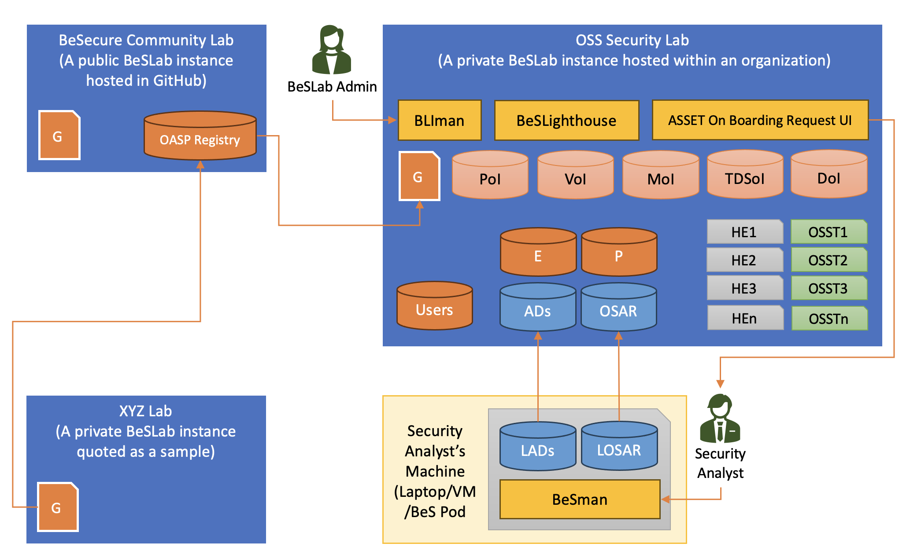
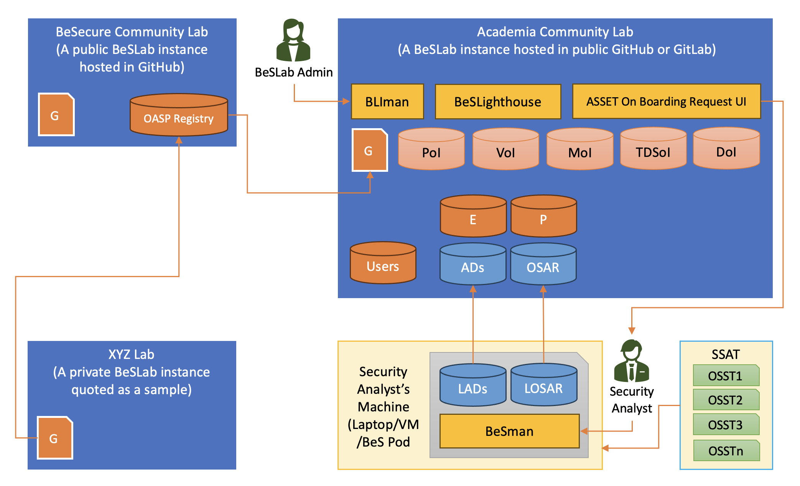
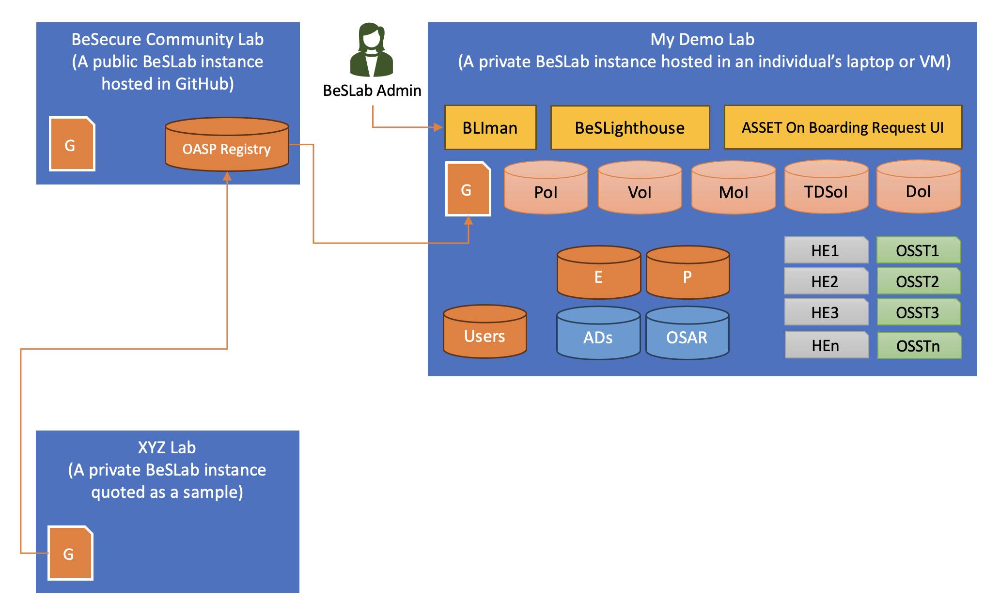
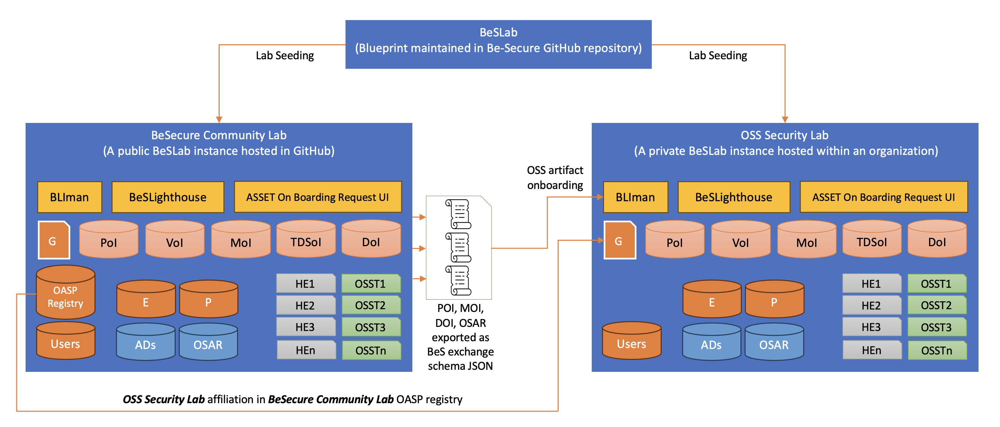

An open source security lab blueprint dedicated to fortifying open source projects, models, training dataset against potential vulnerabilities. Designed to operate efficiently even in low-resource settings, BeSLab provides a comprehensive solution that grants complete control and transparency to application security and security operations teams. Additionally, it serves as a valuable resource for security researchers by streamlining the process of bringing open source projects under scrutiny and significantly reducing remediation time.

With BeSLab, security professionals can leverage its suite of tools and functionalities to conduct thorough assessments, perform rigorous testing, and identify potential security gaps within open source projects. By offering complete visibility and control, BeSLab empowers security teams to implement robust security measures and safeguards, ensuring the integrity and resilience of open source software. You can leverage BeS Environment Script Repository & BeS Playbooks to Launch OSS Security exploits(Red Teaming) and patching OSS vulnerabilites (Blue Teaming) from within a BeSLab.

# Features
* BeSLab is a blueprint hosted in BeSecure GitHub repository.
* An organization (private / community / individual) utilizes the BeSLab blueprint to seed a lab instance in the infrastructure available with the organization.
* A BeSLab instance is mainly concerned with open source artifacts such as project, ml models, training dataset, vulnerabilities. The lab address them as Projects of Interest (PoI), Models of Interest (MoI), Training Datasets of Interest (TDoI), Documents of Interest (DoI) and Vulnerabilities of Interest (VoI).
* BeSecure community hosts a publicly available BeSLab instance in GitHub called BeSecure Community Lab.
* Each BeSLab instance is a registered Open Source Assurance Provider (OSAP). BeSecure Community Lab maintains the registry of all affiliated BeSLab instances across the world.
* BeSLab instances across the world can exchange assets data using a standard interchange format called as BeS Exchange Schema.
* BeSLighthouse is a dashboard that acts as the face of a BeSLab instance.
* The core of a BeSLab instance is an installation of BeSLighthouse, a Git based source code management tool and a bunch of datastore repositories.
* The Git based source code management platform in the lab has datastore repositories that maintains the details of PoI, MoI, TDoI, DoI and VoI.
* The outcome of any BeSLab instance is the attested and verified risk posture report of the open source artifact.
* The key idea of having a BeSLab is to drop the overall cost of doing risk assessment of open source artifacts as the interested parties can subscribe to a lab service.
* The risk posture assessment of open source artifact is done by a cybersecurity analyst by utilizing the automated environments and playbooks for the open source artifacts and tools respectively. The assessment outcome is submitted to the lab by the analyst for publishment, attestation and maintenance.
* BeSecure community in GitHub has published open source environments and playbooks that can be utilized by the cybersecurity analyst.
* A cyber security analyst must get a membership to the lab to be part of the lab.

#### Actors in a BeSLab

* **Organization** - hosts the OSS Security lab instance
* **BeSLab Admin** – Seeds and manages the lab operations
* **Security Analyst** – Member or contributor to a lab, who utilizes the lab for red teaming and blue teaming efforts
* **Consumers/Subscribers** - Organizations or individuals who consumer/subscribes to OSS Security Lab services

#### Activities in a BeSLab

* Seed a new lab
* Add members to the lab
* Onboard open source artifacts (PoI, MoI, TDoI, DoI, VoI)
* Risk assessments of open source artifacts
* Publish assessment reports
* Attest a report
* Verify a report issued by the lab
* Distribute the TAVOSS version of an artifact

## Types of BeSLab

#### Private Lab
Lab hosted privately inside an organization’s private code collaboration platform



#### Public Lab
Lab hosted in a community namespace of a public code collaboration platform like GitHub



#### Personal Lab
Lab hosted privately within an individual’s laptop or a virtual machine



#### Glossary of terms used in the above diagrams
<table>
  <tbody>
    <tr>
      <td><code>PoI</code></td>
      <td>OSS Projects of Interest</td>
    </tr>
    <tr>
      <td><code>VoI</code></td>
      <td>Vulnerabilities of Interest</td>
    </tr>
    <tr>
      <td><code>MoI</code></td>
      <td>Models Of Interest</td>
    </tr>
    <tr>
      <td><code>TDSoI</code></td>
      <td>Training Datasets Of Interest</td>
    </tr>
    <tr>
      <td><code>DoI</code></td>
      <td>Document Of Interest</td>
    </tr>
    <tr>
      <td><code>E</code></td>
      <td>BeSEnvironments Datastore</td>
    </tr>
    <tr>
      <td><code>P</code></td>
      <td>BeSPlaybooks Datastore</td>
    </tr>
    <tr>
      <td><code>ADS</code></td>
      <td>Attestation Datastore</td>
    </tr>
    <tr>
      <td><code>OSAR</code></td>
      <td>Open Source Assessment Report</td>
    </tr>
    <tr>
      <td><code>HE1..N</code></td>
      <td>Hosted BeS Environments 1.. N</td>
    </tr>
    <tr>
      <td><code>OSST..N</code></td>
      <td>Open Source Security Tools 1..N</td>
    </tr>
    <tr>
      <td><code>LE1..N</code></td>
      <td>Local BeSEnviornments</td>
    </tr>
    <tr>
      <td><code>G</code></td>
      <td>Genesis File for a Lab</td>
    </tr>
    <tr>
      <td><code>OASP</code></td>
      <td>OSS Assurance Service Provider</td>
    </tr>
  </tbody>
</table>

#### BeSLab Instances Interactions



## Glossary

<table>
  <thead>
    <tr>
      <th>Field</th>
      <th>Description</th>
    </tr>
  </thead>
  <tbody>
    <tr>
      <td><code>BeSecure</code></td>
      <td>Open source community ecosystem developed and maintained by open source security specialists</td>
    </tr>
    <tr>
      <td><code>BeS</code></td>
      <td>Short form for BeSecure</td>
    </tr>
    <tr>
      <td><code>BeSLab</code></td>
      <td>Open source security lab blueprint dedicated to fortifying open source projects, models, training dataset. Utilize this blueprint to spin up an open source security lab.</td>
    </tr>
    <tr>
      <td><code>BeSLab Admin</code></td>
      <td>Administrator of a BeSLab instance</td>
    </tr>
    <tr>
      <td><code>Cybersecurity Analyst</code></td>
      <td>Member of a BeSLab instance who does the RT and BT activities on the open source artifacts.</td>
    </tr>
    <tr>
      <td><code>BeSPod</code></td>
      <td>Group of skilled people who can utilize a lab to do Red Teaming and Blue Teaming on open source artifacts</td>
    </tr>
    <tr>
      <td><code>BLIman</code></td>
      <td>Command line utility for the administration of a BeSLab instance. BeSLab Admin utilizes this for lab seeding, artifact onboarding, member onboarding etc</td>
    </tr>
    <tr>
      <td><code>Genesis File</code></td>
      <td>Configuration file utilized by the BLIman to seed a BeSLab instance</td>
    </tr>
    <tr>
      <td><code>BeSEnvironments</code></td>
      <td>A customized computing set up with all the tools necessary pre-installed to do security assessments and remediation. The environments are packaged as shell scripts that will be executed on a target machine using BeSMan</td>
    </tr>
    <tr>
      <td><code>BeSMan</code></td>
      <td>Command line utility to create a BeS Environment</td>
    </tr>
    <tr>
      <td><code>BeSPlaybooks</code></td>
      <td>Automated execution steps for a specific tool or an activity</td>
    </tr>
    <tr>
      <td><code>BeSecure Community Lab</code></td>
      <td>A public BeSLab instance hosted in GitHub, also acts as the registry of all BeSLab instances in the world</td>
    </tr>
    <tr>
      <td><code>Open Source Projects of Interest (PoI)</code></td>
      <td>Open source project that a BeSLab is providing security services like assessment and remediation</td>
    </tr>
    <tr>
      <td><code>Open Source Models Of Interest (MoI)</code></td>
      <td>Open source ML model that a BeSLab is providing security services like assessments and remediation</td>
    </tr>
    <tr>
      <td><code>Vulnerabilities of Interest (VoI)</code></td>
      <td>Vulnerability information that a BeSLab is interested since it affects a PoI</td>
    </tr>
    <tr>
      <td><code>Training DataSets Of Interest (TDSoI)</code></td>
      <td>Publicly available ML model training dataset that a BeSLab wants to provide validation services</td>
    </tr>
    <tr>
      <td><code>Document Of Interest (DoI)</code></td>
      <td>Content needing attestation / plagiarism checks / Deep fake detection and copyright / water marking. The CDN will work as a datastore or document database in this.</td>
    </tr>
    <tr>
      <td><code>Open Source Artifacts</code></td>
      <td>PoI, MoI, TDoI, DoI and VoI</td>
    </tr>
    <tr>
      <td><code>TAVOSS</code></td>
      <td>Trusted and Verified Open Source Software is a patched distribution of PoI and MoI</td>
    </tr>
    <tr>
      <td><code>OSS Assurance Service Provider (OASP)</code></td>
      <td>Each BeSLab instance is an OASP that provides assurance services on the open source artifacts it is interested in.</td>
    </tr>
    <tr>
      <td><code>BeSLighthouse</code></td>
      <td>Dashboard that gives a view into the services of a lab.</td>
    </tr>
    <tr>
      <td><code>Attestation Datastore</code></td>
      <td>Datastore that hosts digitally attested artifacts issued by a BeSLab instance.</td>
    </tr>
    <tr>
      <td><code>Open Source Assessment Report (OSAR)</code></td>
      <td>Open source artifact assessment reports issued by the lab. For instance, a vulnerability assessment report on an OSS project is an OSAR.</td>
    </tr>
    <tr>
      <td><code>Open Source Security Tools (OSST)</code></td>
      <td>The tools used for the risk assessment of open source artifacts maintained in the lab.</td>
    </tr>
  </tbody>
</table>

## Getting Started
#### Seed a new BeSLab instance
- Lab admin affiliates the new lab into OASP registry (maintained at BeSecure Community Lab) and downloads the genesis file template.
- Configure genesis file to meet the lab requirements
- Install BLIman 
```
curl -L https://be-secure.github.io/BLIman/get.bliman.io | bash
```
- Initiliaze BLIman. This installs BeSman
```
bli init light
```
- Launch the lab. Downloads the environment scripts for lab from BeSLab repository and executes it.
```
bli launch
```
- Verify the lab installation
```
bli status
```
