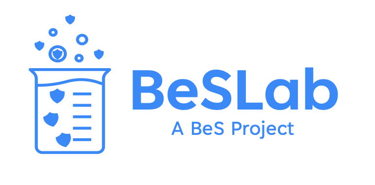

BeSLab is an open source security lab dedicated to fortifying open source projects against potential vulnerabilities. Designed to operate efficiently even in low-resource settings, BeSLab provides a comprehensive solution that grants complete control and transparency to application security and security operations teams. Additionally, it serves as a valuable resource for security researchers by streamlining the process of bringing open source projects under scrutiny and significantly reducing remediation time.

With BeSLab, security professionals can leverage its suite of tools and functionalities to conduct thorough assessments, perform rigorous testing, and identify potential security gaps within open source projects. By offering complete visibility and control, BeSLab empowers security teams to implement robust security measures and safeguards, ensuring the integrity and resilience of open source software. You can leverage BeS Environment Script Repository & BeS Playbooks to Launch OSS Security exploits(Red Teaming) and patching OSS vulnerabilites (Blue Teaming) from within a BeSLab.

